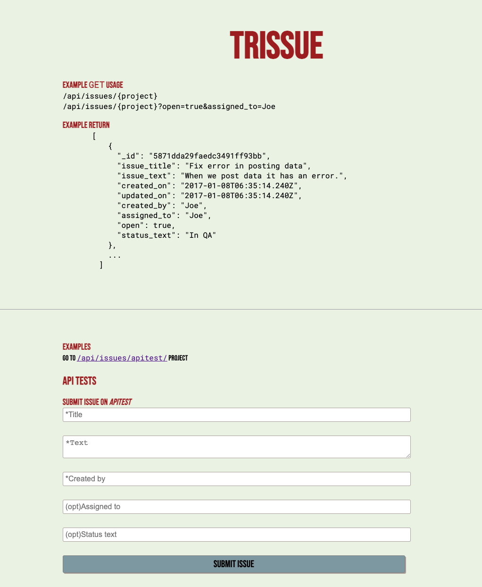

# Trissue



An issue tracking API service. Written as part of the [FreeCodeCamp](https://www.freecodecamp.org) challenges.

Special thanks to Prosper Opara, the author of [this article](https://www.codementor.io/@oparaprosper79/understanding-node-error-err_http_headers_sent-117mpk82z8), who pointed me towards a retrospectively obvious solution to a problem that was killing me. You have to actually *return* after catching a condition or things keep running!

Also of note: I was struggling to pass the FCC tests thanks to something quite niche. All my functional tests were passing, and the app seemed to work from a user perspective just fine. Yet I would get 2 errors in the console:

```json
freecodecamp expected { Object (result, _id) } to deeply equal { Object (error, _id) }
freecodecamp expected { Object (result, _id) } to deeply equal { Object (error, _id) }
```

One for the `PUT` test and one for the `DELETE` test.

my code for the `PUT` update was:

```javascript
Issue.findByIdAndUpdate(id, update, {new: true}, (err, doc) => {
  if (err) {
    return res.json({ error: "could not update", _id: id });
  } else {
    return res.json({ result: "successfully updated", _id: id })
  }
});
```

It requires an else if to catch the fact that mongoose will return null in some cases:

```javascript
Issue.findByIdAndUpdate(id, update, {new: true}, (err, doc) => {
  if (err) {
    return res.json({ error: "could not update", _id: id });
  } else if (doc === null){ //this is super important! fcc tests fail without it
    return res.json({ error: 'could not update', '_id': id })
  } else {
    return res.json({ result: "successfully updated", _id: id })
  }
});
```

Finally found this on a forum post [here](https://forum.freecodecamp.org/t/issue-tracker-only-post-requests-pass/440646/12). Would have been stuffed without it!

This is the same issue with the `DELETE` test. I was using `deleteOne()`. Better to use `findByIdAndRemove` in exactly the same manner described above.
